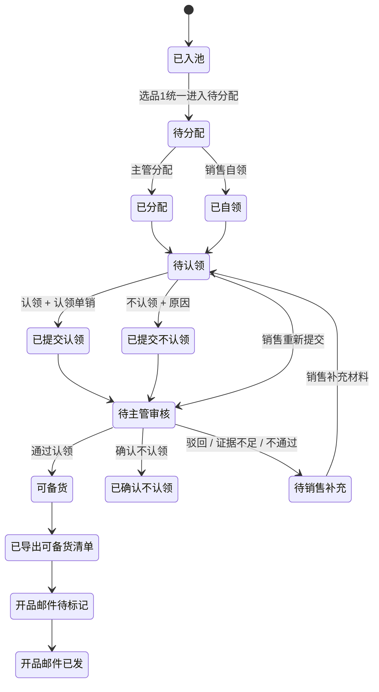
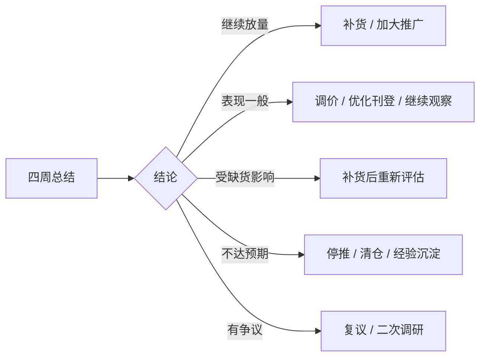
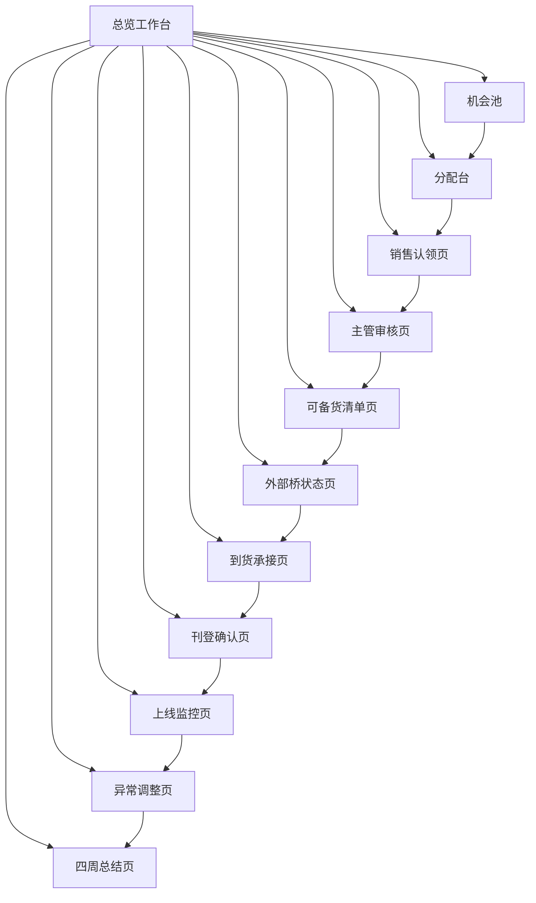

# 东南亚新品全链路原型架构设计

> **历史原型材料：** 刊登字段、观察周期、周数据和四周总结已在 2026-07-16 重新确认；与 `2026-07-09-已确认需求记录.md` 冲突的内容不得作为实现依据。

> 日期：2026-06-30  
> 用途：产品原型评审，说明“整条新品链路怎么设计、第一版先落哪里”。  
> 口径：这是业务产品框架，不包含内部开发协作方式。

## 1. 一句话框架

这套系统要覆盖新品从“机会入池”到“四周复盘”的完整生命周期，但第一版先落最关键、最容易混乱的前段：`入池 -> 分配/自领 -> 销售认领/不认领 -> 主管审核 -> 可备货清单`。

整体设计不是一条简单线性流程，而是：

```text
前段平台主流程
  -> 外部桥（备货 / 采购 / 供应链 / 下单 / 运输）
  -> 后段平台主流程
```

平台拥有前段和后段；中间备货采购由外部部门执行，平台做导出、状态登记和到货回流。

## 2. 全链路总览

```mermaid
flowchart LR
  A["01 数据入池"] --> B["02 去重与主 SKU 分组"]
  B --> C["03 分配 / 销售自领"]
  C --> D["04 销售认领 / 不认领"]
  D --> E["05 主管审核"]
  E --> F["06 可备货清单 / 开品邮件"]

  F --> G["外部桥：开发备货 / 销售备货 / 供应链核价 / 采购下单 / 运输"]
  G --> H["07 到货通知回流"]
  H --> I["08 到货承接 / 提醒"]
  I --> J["09 二次调研"]
  J --> K["10 具体调整 / 竞品监控"]
  K --> L["11 刊登确认 / ItemID / 链接 / 店铺 / 售价"]
  L --> M["12 上线后 1-4 周监控"]
  M --> N["13 四周总结"]
  N --> O["14 后续动作：补货 / 调价 / 停推 / 复议 / 经验沉淀"]

  A:::mvp
  B:::mvp
  C:::mvp
  D:::mvp
  E:::mvp
  F:::mvp
  G:::bridge
  H:::later
  I:::later
  J:::later
  K:::later
  L:::later
  M:::later
  N:::later
  O:::later

  classDef mvp fill:#e8f3ff,stroke:#2563eb,color:#172554
  classDef bridge fill:#fff7ed,stroke:#ea580c,color:#7c2d12
  classDef later fill:#f3f4f6,stroke:#64748b,color:#111827
```



颜色口径：

| 颜色 | 含义 |
|---|---|
| 蓝色 | 第一版优先落地 |
| 橙色 | 外部桥，平台只衔接 |
| 灰色 | 后续阶段，先完成设计 |

## 3. 分期落地

| 阶段 | 名称 | 平台做什么 | 业务验收看什么 |
|---|---|---|---|
| Phase 1 | 前段·选品决策闭环 | 入池、分配、自领、认领/不认领、主管审核、可备货清单 | 每条机会有负责人、状态、证据、审核结论和导出结果 |
| 外部桥 | 备货采购执行 | 导出清单、登记开品邮件/备货状态、接收到货通知 | 不做平台待办；只看衔接状态是否可追踪 |
| Phase 2 | 到货提醒与二次调研 | 到货回流、上架/可售确认、二次调研、具体调整 / 竞品监控 | 货到后运营知道该做什么，调研结论和调整动作可追踪 |
| Phase 3 | 刊登确认与 1-4 周监控 | ItemID/链接/店铺/售价回填，缺货、广告费、销量、库存和推品动作跟进 | 刊登记录完整，异常能提醒到人，处理动作有记录 |
| Phase 4 | 四周总结与沉淀 | 四周表现复盘、缺货影响判断、后续动作 | 形成补货/调价/停推/复议/沉淀结论 |

## 4. Phase 1 详细流程



关键修正：

- 主管“驳回 / 不通过 / 证据不足”不是死结论，统一回到销售补充。
- 不认领也必须进入主管审核；主管确认不认领后才关闭，不进入可备货清单。
- 页面全部展示中文状态，不展示 `sales_claim`、`pending`、`claim_rejected` 等内部编码。

## 5. 外部桥设计

外部桥不是平台待办主流程，但必须能被追踪。

```text
可备货清单
  -> 开品邮件待标记 / 已发
  -> 开发备货确认
  -> 销售/组长备货确认
  -> 供应链核价
  -> 采购下单
  -> 开船 / 到港 / 到仓
  -> 到货通知回流
```

平台第一版只做：

- 导出可备货清单。
- 记录开品邮件状态。
- 预留外部状态登记入口。
- 后续通过到货通知回流进入后段。

外部桥暂不做：

- 不做采购审批。
- 不做供应链核价流。
- 不做采购下单流。
- 不给开发/采购建平台待办。

## 6. Phase 2 到货提醒、二次调研与具体调整


页面设计：

| 页面 | 展示重点 |
|---|---|
| 到货承接页 | 到货单号、仓库、到货日期、到货数量、关联主/子 SKU、认领销售 |
| 二次调研与调整页 | 竞品链接、竞品价格 / 销量、调研结论、产品定位、调整动作 |
| 到货异常页 | 到货不足、未上架、未触发二次调研、信息缺失 |

## 7. Phase 3 刊登确认与 1-4 周监控

刊登确认后每周检查，不等到四周才发现问题。

```text
第 1 周检查
  -> 第 2 周检查
  -> 第 3 周检查
  -> 第 4 周检查
  -> 四周总结
```

监控内容：

| 监控项 | 判断什么 | 可能动作 |
|---|---|---|
| 销量 / 销售额 | 是否达到认领单销或阶段目标 | 继续推、调价、补充竞品监控 |
| 库存 / 缺货 | 是否因为库存影响表现 | 补货、转仓、暂停判断 |
| 广告费 / ROI | 推广是否异常 | 调预算、换词、停广告 |
| 售价 / 毛利 | 售价是否影响转化或利润 | 调价、重算利润 |
| 竞品变化 | 市场是否变了 | 更新竞品监控、重新定位 |

异常处理状态：

```text
正常观察 -> 异常待处理 -> 已安排动作 -> 已完成动作 -> 等待复盘
```

## 8. Phase 4 四周总结与后续动作

四周总结不是单纯填一段话，而是形成下一步决策。

| 总结项 | 说明 |
|---|---|
| 四周实际销量 / 销售额 / 毛利 | 判断是否达到预期 |
| 广告费 / ROI | 判断推广投入是否合理 |
| 缺货影响 | 区分“卖不好”和“没货卖” |
| 达成判断 | 达成、部分达成、未达成 |
| 总结结论 | 继续放量、优化观察、补货、调价、停推、复议 |
| 后续动作 | 形成下一轮补货/调价/推广/清仓/复议任务 |

完整闭环：



## 9. 页面总架构



| 页面 | 阶段 | 必须展示 |
|---|---|---|
| 总览工作台 | 全链路 | 每阶段数量、逾期、异常、待处理人 |
| 机会池 | Phase 1 | 商品图、主/子 SKU、站点、类目、关键词、来源行 |
| 分配台 | Phase 1 | 推荐销售、推荐原因、当前负载、改派原因 |
| 销售认领页 | Phase 1 | 商品图、竞品、开品理由、认领单销、不认领原因 |
| 主管审核页 | Phase 1 | 认领/不认领证据、CH 截图、审核意见、退回原因 |
| 可备货清单页 | Phase 1 / 外部桥 | 导出字段、备货量、开品邮件状态 |
| 外部桥状态页 | 外部桥 | 开品邮件、备货确认、核价、采购、运输状态 |
| 到货承接页 | Phase 2 | 到货数量、仓库、到货日期、认领销售、异常 |
| 二次调研与调整页 | Phase 2 | 竞品链接、调研结论、产品定位、调整动作 |
| 刊登确认页 | Phase 3 | ItemID、链接、店铺、售价、可售库存 |
| 1-4 周监控页 | Phase 3 | 1-4 周销量、销售额、库存、广告、ROI |
| 异常调整页 | Phase 3 | 缺货、广告异常、售价异常、竞品变化、处理动作 |
| 四周总结页 | Phase 4 | 达成判断、缺货影响、总结结论、后续动作 |

## 10. 产品原型评审讲法

1. 先讲完整蓝图：从机会入池到四周总结，整条链路已经设计好。
2. 再讲平台边界：平台拥有前段和后段，中间备货采购是外部桥。
3. 再讲第一版：先落 Phase 1，因为它决定后续有没有清晰的责任、证据和可备货结论。
4. 强调关键控制点：不认领也审核；主管驳回回到销售补充；图片和 CH 证据进审核。
5. 最后确认优先级：是否按 Phase 1 先落地，再接外部桥状态和后段到货提醒 / 二次调研。
