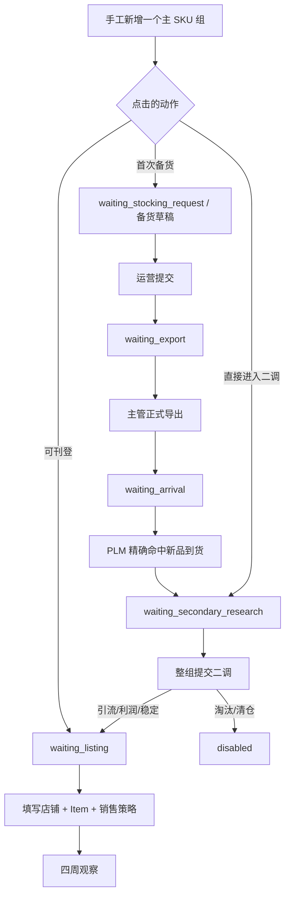

# 手工新增 SKU 多去向与 Git 单分支收敛设计

> 状态：待用户确认
>
> 基线：`dd76728661c1b0e395d597139975446770c8926b`（`prod-2026-08-25-baseline`）

## 1. 目标

本次只完成两件事：

1. 把“新增二调 SKU”扩展成一个可录入多个子 SKU 的手工入口，补齐关键词、三组竞品、目标单销和竞对参考售价，并让整组商品按所点按钮进入现有的二调、首次备货或待刊登流程。
2. 在功能验证后把 Git 收敛为唯一长期分支 `main`；生产基线标签保留，旧中间分支不合并、不打归档标签。

本设计不部署生产，不修改生产数据库、配置、容器、钉钉或 PLM 作业。

## 2. 已确认边界

- `main` 是以后唯一维护的长期分支。
- `main` 可以从当前提交快进到生产基线，不强推、不制造合并提交。
- `lxc/history-data-plan` 和 `lxc/report-video-20260824` 只是中间状态；不把其独立提交合并到最终代码，也不为它们保留标签。
- 清理旧分支前仍要在仓库外保存可恢复备份；该备份只用于误删恢复，不属于最终 Git 历史。
- 一次弹窗提交代表一个主 SKU 组：国家、负责人、业务期、主 SKU、主 SKU 名称和关键词由全部子 SKU 共用。
- 一次提交只选择一个去向；如果同一主 SKU 的不同子 SKU 要走不同去向，应分两次新增，避免半组进入不同工作台。
- 子 SKU 名称非必填；子 SKU 可通过 `+ 添加子 SKU` 增加。
- 关键词使用现有 `NewProductOpportunity.keyword`，不新增数据库字段。
- 首次备货复用完整既有链路；“可刊登”复用既有“有库存且不新增备货”分支。

## 3. 现状核对

### 3.1 已有可复用数据

- 商品已有 `keyword`。
- `MarketResearchItem` 已有竞品链接、竞品售价、竞品月销、参考单销和参考售价。
- `SalesClaimForecast` 已有 `secondary_target_daily_sales`。
- 当前选品 1 快照和商品详情已经识别以下三组列：

| 业务组 | 链接 | 售价 | 月销 | 既有 `research_type` |
|---|---|---|---|---|
| 最低价 | Z | AA | AB | `最低价` |
| 月销最高 | AC | AD | AE | `most_orders` |
| 新晋 | AL | AM | AN | `新晋` |

参考/目标单销沿用 AO，竞对参考售价沿用 AP。手工数据必须同时写入规范化模型和兼容快照，否则商品详情或导出只能看到其中一份。

### 3.2 已有可复用流程

- 直接二调：`waiting_secondary_research`。
- 首次备货：`waiting_stocking_request` → 备货草稿提交 → `waiting_export` → 正式导出 → `waiting_arrival` → PLM 精确识别新品到货 → `waiting_secondary_research`。
- 可刊登：既有 `inventory_available=true`、`needs_stocking=false` 分支直接进入 `waiting_listing`，后续仍须填写店铺、Item 和销售策略才开始四周观察。

因此不新增状态、不伪造到货记录，也不在点击“首次备货”时直接发送到货通知。通知和二调开启仍只由真实 PLM 新品到货触发。

### 3.3 当前货币问题

系统目前没有统一的“站点 → 货币”映射。`site_codes.py` 只维护站点代码和中文名；PHP、THB、VND 主要散落在旧 Excel 表头、导入别名和固定列说明中。这些文字是外部源表兼容契约，不能全局替换。

## 4. 弹窗设计

入口仍放在二次调研页面，标题改为“新增 SKU”。顶部保留公共信息，下面按子 SKU 卡片展示业务字段。

### 4.1 公共字段

| 字段 | 必填 | 说明 |
|---|---:|---|
| 国家 | 是 | 继续使用当前国家选择；服务端规范成站点代码 |
| 负责人 | 是 | 普通运营锁定本人；主管按现有权限选择负责人 |
| 业务期 | 否 | 默认当前自然周，可改 |
| 主 SKU | 是 | 整组共用 |
| 主 SKU 名称 | 否 | 整组共用 |
| 关键词 | 否 | 整组共用并复制到每个子 SKU 商品记录 |

### 4.2 每个子 SKU 字段

| 字段 | 必填 | 校验/含义 |
|---|---:|---|
| 子 SKU | 是 | 同一请求内忽略大小写去重 |
| 子 SKU 名称 | 否 | 按用户要求保持非必填 |
| 目标单销 | 见下文 | 一个输入复用既有目标/参考单销表示，不再建第二个字段 |
| 竞对参考售价 | 否 | 非负数；标签显示当前国家的 ISO 货币代码 |
| 二调锚定链接 | 否 | 与前三组初调竞品链接语义不同，继续单独保存 |
| 最低价竞品：链接/售价/月销 | 否 | 对应 Z/AA/AB |
| 月销最高竞品：链接/售价/月销 | 否 | 对应 AC/AD/AE |
| 新晋竞品：链接/售价/月销 | 否 | 对应 AL/AM/AN |

链接填写后必须是 `http://` 或 `https://`；售价、月销和参考售价不得为负。竞品组允许只填部分值，已填部分必须完整保存，不能因缺少链接而静默丢掉售价或月销。

目标单销采用去向相关校验：

- “直接进入二调”可暂空，后续二调提交前仍按现有规则必填。
- “首次备货”和“可刊登”必须大于 0；否则备货数量或观察目标没有可靠依据。

### 4.3 子 SKU 增删

- 初始展示一个子 SKU 卡片。
- `+ 添加子 SKU` 追加空卡片；多于一个时可删除。
- 至少保留一个子 SKU，沿用现有销售自选的批量上限，不另造一套限制。
- 服务端再次执行相同去重和必填校验，不能只依赖前端。

### 4.4 底部动作

除“取消”外提供三个明确动作，所点动作作为本次整组的 `route`：

| 按钮 | `route` | 结果 |
|---|---|---|
| 直接进入二调 | `direct_secondary` | 进入二调待处理，不跑 PLM、不发钉钉 |
| 首次备货 | `initial_stocking` | 创建首次备货草稿，按既有导出和 PLM 到货链路推进 |
| 可刊登 | `ready_to_list` | 视为已有可用库存且不新增备货，直接进入待刊登 |

三个按钮共用同一套校验和提交函数，仅传入不同 `route`，不复制三套表单逻辑。

## 5. 数据契约与持久化

继续使用现有手工新增接口，在请求中增加 `route` 和 `children[]`。不新增数据库表或迁移。

```text
country, site?, salesperson_name, business_period?,
main_sku, main_sku_name?, keyword?, route,
children[] = {
  sub_sku, sub_sku_name?, target_daily_sales?, reference_price?,
  secondary_competitor_url?,
  competitors = {
    lowest?, most_orders?, new_arrival?
  }
}
```

每个竞品对象只包含 `url?`、`price?`、`monthly_sales?`。

### 5.1 单一事实来源

| 输入 | 规范化存储 | 兼容快照 |
|---|---|---|
| 关键词 | `NewProductOpportunity.keyword` | E 及字段表 |
| 三组竞品 | 每个有值组一条 `MarketResearchItem` | Z:AN 对应列、表头和值 |
| 目标单销 | `SalesClaimForecast.secondary_target_daily_sales`；首次备货同时写入 `claim_daily_sales` 以生成备货草稿 | AO |
| 竞对参考售价 | 各已创建 `MarketResearchItem.reference_price`；即使没有竞品组也保留于快照 | AP |
| 二调锚定链接 | `SalesClaimForecast.secondary_competitor_url` | 手工来源元数据 |
| 货币 | 由站点推导，不单独建业务列 | `currency_code` |

商品详情和导出继续读现有结构；手工新增快照补齐 `headers_by_column`、`fields_by_column`、`fields_by_header` 和来源元数据，不改旧导入器的表头兼容规则。

### 5.2 来源追溯

- 沿用现有手工来源命名空间，避免为三个按钮新增三种商品模型。
- 每个子 SKU 都保存独立 `SourceRecordSnapshot`，`source_row` 使用本次请求中的子项顺序。
- 快照记录 route、操作者、负责人、国家/站点、业务期、主/子 SKU、货币和全部手工输入。
- 每个子 SKU 写审计记录；组级审计额外记录 route 和子 SKU 数量。
- 手工新增只允许商品看板中不存在的站点 + 主 SKU + 子 SKU。发现任何有效现有商品时整组失败并明确指出冲突 SKU，不覆盖导入快照或其他运营的数据。

### 5.3 原子性

同一次请求内的所有子 SKU 在一个数据库事务中完成。任一子 SKU 校验失败、重复或状态创建失败，整组回滚，禁止出现只新增一半的主 SKU 组。

## 6. 货币设计

新增最小站点货币映射：

| 站点 | 货币 |
|---|---|
| PH | PHP |
| TH | THB |
| VN | VND |
| MY | MYR |
| SG | SGD |
| ID | IDR |

前端按当前国家显示 `竞品售价（PHP）`、`竞对参考售价（THB）` 等标签；使用 ISO 代码而不是 `$` 等歧义符号。数据库仍保存数值，站点决定币种；手工快照同时冻结 `currency_code` 以便追溯。

本轮不做汇率换算、不增加金额货币列、不重写历史表头。以后只有出现“同一商品金额可能脱离站点独立换币”这一真实需求时，才考虑给金额增加独立币种字段。

## 7. 路由状态图



## 8. 权限与防错

- 普通运营只能为本人新增；请求中的负责人不能绕过服务端身份。
- 主管/超管沿用现有代选负责人的权限，不扩大到普通用户。
- 站点必须能规范化；未知站点拒绝，而不是猜币种。
- 三个 route 使用服务端白名单；不能由客户端传任意状态名。
- “可刊登”不会自动创建店铺或 Item，也不会伪造二调提交时间、产品定位或到货事实。
- “首次备货”只创建草稿，仍需运营补全并提交、主管正式导出；未导出不能被 PLM 推进。
- 本入口不主动发送钉钉消息。后续既有流程是否通知保持原规则。

## 9. 最小验收标准

### 9.1 后端

- 多子 SKU 直接二调能保存关键词、三组竞品、目标单销、参考售价、锚定链接、快照和审计，状态正确。
- 首次备货能为每个子 SKU 创建平台认领责任和首次备货草稿；现有提交、导出、PLM 到货测试证明最终进入二调。
- 可刊登直接生成 `waiting_listing` 责任，且观察目标读取本次目标单销。
- 同请求重复子 SKU、数据库已有 SKU、非法 URL/数值、越权负责人或未知 route 时整组不落库。
- PH/TH/VN/MY/SG/ID 的货币代码映射正确。

### 9.2 前端

- 弹窗可添加/删除多个子 SKU，名称可空，错误显示在对应子项。
- 切换国家后价格字段立即显示正确 ISO 货币代码。
- 三组竞品、关键词、目标单销和参考售价均进入请求；三种按钮只改变 route。
- 提交期间全部动作禁用，成功后进入相应工作台提示，失败时保留已填内容。
- 键盘焦点、字段 label 和关闭按钮保持可访问。

### 9.3 回归

- 现有销售自选多子 SKU、备货导出、PLM 到货、二调整组提交、刊登与观察链路保持通过。
- 只校准与本改动直接相关的陈旧断言；生产基线已有的 18 个后端和 6 个前端历史失败必须如实单列，不能为了“全绿”改回旧业务语义。
- 前端构建、Alembic 单一 head、`git diff --check` 通过。

## 10. Git 收敛顺序

功能和测试通过后才清理 Git，顺序固定：

1. 再次核验生产基线标签和 feature 提交均为预期祖先关系。
2. 在 `E:\Project\Hengzhe-New-Product-Workflow-backups\` 下生成新的完整 bundle；为每个脏工作树保存二进制补丁、已暂存补丁和未跟踪文件实体。发现 `.env`、凭据或其他敏感文件时停止删除对应工作树并单独报告，不把它们写进 Git。
3. 校验备份哈希并做至少一次清单/补丁可读验证；未验证的备份不能作为删除依据。
4. 处理当前脏 `main` 工作树后，先把 `main` `--ff-only` 快进到生产基线，再 `--ff-only` 快进到已验证功能提交；不 force、不 rebase、不生成 merge commit。
5. 运行最终验证并检查 `main` 干净、生产基线标签仍可解析。
6. 删除所有旧本地工作树和除 `main` 外的本地分支，包括本次临时 feature 分支；`lxc/history-data-plan` 与 `lxc/report-video-20260824` 不合并、不打标签。
7. 精确列出远端分支后，仅推送已验证的 `main`，再删除远端旧分支；生产基线标签保留为只读恢复点，不作为日常维护分支。
8. 最终要求：`git branch` 只有 `main`，`git worktree list` 只有主工作树，工作区干净；仓库外恢复包和校验值已记录。

Git 推送不等于部署。本任务不执行生产发布；需要上线时再走独立的生产部署和读回验证。

## 11. 非目标

- 不增加“关键词”新字段或新表。
- 不增加货币换算、汇率抓取或全站金额重构。
- 不新增流程状态、通知类型、PLM 模糊匹配或人工到货记录。
- 不把三组竞品扩展成五组；截图外的月销次高和第三高本轮不录入。
- 不自动生成店铺、Item、产品定位或销售策略。
- 不保留旧中间分支的合并提交、归档标签或视频/旧计划文件。
- 不在本任务部署生产。

## 12. 自审结论

- 所有新增业务数据都有现有字段或 JSON 快照承接，无数据库迁移。
- 三条去向复用现有状态和权限边界，没有第二套流程。
- 货币只解决新表单的单位显示和追溯，不破坏旧 Excel 表头兼容。
- 多子 SKU、重复防护和事务回滚覆盖最主要的数据一致性风险。
- Git 删除安排在功能验证和外部备份之后，最终只保留 `main` 与生产基线标签。
- 文档中无待实现占位符；唯一需要用户确认的是本规格整体，尤其是“一次整组只能选择一个去向”的交互边界。
